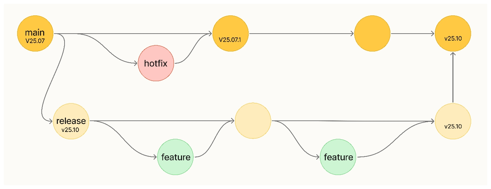

Development Setup
------------------
### Prerequisites
- Node.js (v14 or higher)
- npm
- Running instances of bitcoind and core-lightning

### Installation
#### Clone the repository:

```sh
git clone https://github.com/ElementsProject/cln-application.git
cd cln-application
```

#### Install dependencies:

```sh
npm install
```

#### Configure environment:

```sh
cp env.sh env-local.sh
# Edit env-local.sh with your configuration
source env-local.sh
```

#### Set up Commando authentication:
- Manually update `LIGHTNING_PUBKEY` and `LIGHTNING_RUNE` in your `LIGHTNING_VARS_FILE`
- OR Run the setup script:

```sh
source entrypoint.sh
```

Running the Application
------------------------
### Backend server:

```sh
npm run backend:watch
npm run backend:serve
```

### Frontend development server (port 4300):
```sh
npm run frontend:dev
```

Creating a Pull Request
------------------------
- Fork the repository on GitHub
- Create a feature branch:

```sh
git checkout -b feat/your-feature-name
```
- Commit your changes:

```sh
git commit -m "feat: description of your changes"
```
- Push to your fork:

```sh
git push fork feat/your-feature-name
```
- Open a PR against the next-release branch
	- Include clear description
	- Add relevant labels
	- Request reviews from maintainers

- Code Standards
	- Include tests for new features
	- Update documentation when adding/changing functionality
	- Keep commits atomic and well-described

- Basic Git Workflow:
<p align="center">
	
</p>

Release Process
----------------

- Merge the release branch into main:

```sh
git checkout main
git merge Release-yy.mm.n
```
- Create versioned tag:

```sh
export VERSION=vyy.mm.n
git tag -a -s $VERSION -m "$VERSION"
git push --tags
```

- Creating the Release On GitHub:
	- Go to Repository → Releases → Draft new release
	- Select the tag you created
	- Add release notes summarizing changes

- Package and sign the release:

```sh
mkdir -p ./release
git archive --format zip --output ./release/cln-application-${VERSION}.zip main
cd release
sha256sum cln* > SHA256SUMS
gpg -sb --armor -o SHA256SUMS.asc SHA256SUMS
```

- Verify the signature:

```sh
gpg --verify SHA256SUMS.asc
```

- Upload to GitHub:
	- Add cln-application-${VERSION}.zip
	- Add SHA256SUMS and SHA256SUMS.asc

- Post-Release Checks
	- Verify CI/CD pipelines complete successfully
	- Confirm package availability at: https://github.com/orgs/ElementsProject/packages?repo_name=cln-application
