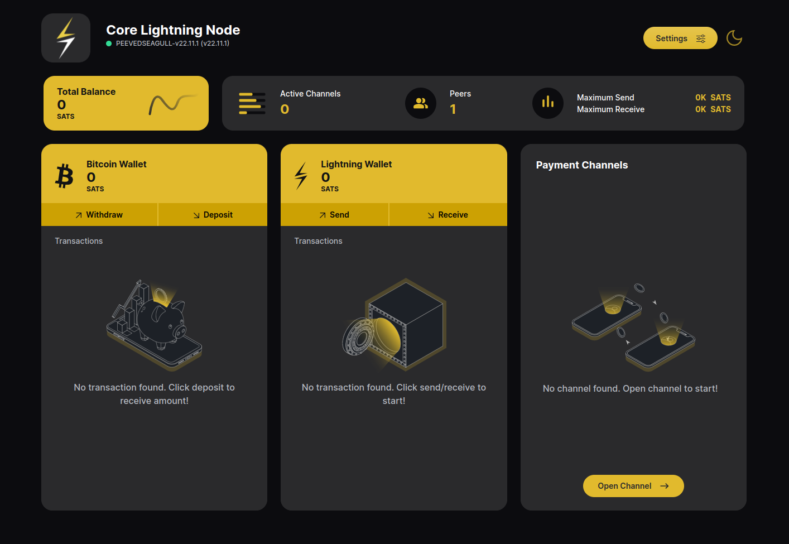

<p align="center">
  <a href="https://github.com/ElementsProject/cln-application">
    
  </a>
  <h1 align="center">Core Lightning Application</h1>
  <h3 align="center">
    Run a Core Lightning application for your node. An official app by Blockstream. Powered by Core Lightning.
    <br />
    <br />
    <div align="center">
      <a href="https://twitter.com/Blockstream">
        
      </a>
      <a href="https://marketplace.start9.com">
        
      </a>
      <a href="https://apps.umbrel.com/app/core-lightning">
        
      </a>
    </div>
  </h3>
</p>

---

# Prerequisites
* Functioning and synced Bitcoin & Core lightning node.
* Node.js, which can be downloaded [here](https://nodejs.org/en/download/)
* Recommended Browsers: Chrome, Firefox, MS Edge

---

# Getting started

- ## Standalone
  - ### Get latest release
      ```
      wget https://github.com/ElementsProject/cln-application/archive/refs/tags/v0.0.1.tar.gz
      tar -xzf v0.0.1.tar.gz
      ```

  - ### Dependency Installation

    ```
    cd cln-application-0.0.1
    npm install --force --omit=dev
    ```

  - ### Environment Variables
      This application accepts & depends upon these variables to be passed through environment:

      ```
      - SINGLE_SIGN_ON: Flag to bypass application level authentication (valid values: true/false, default: false)
      - LOCAL_HOST: Device url for connect url links (optional; for connect wallet screen)
      - DEVICE_DOMAIN_NAME: Device name/IP for lnmessage connect url feature (optional; for connect wallet screen)
      - BITCOIN_NODE_IP: IP address of bitcoin node container (required)
      - BITCOIN_NETWORK: Bitcoin network type (optional; for entrypoint.sh; valid values: bitcoin/signet/testnet/regtest)
      - APP_CONFIG_DIR: Path for cln-application's configuration file (required; config.json)
      - APP_MODE: Mode for logging and other settings (valid values: production/development/testing, default: production)
      - APP_CONNECT: Choose how to connect to CLN (valid values: COMMANDO/REST/GRPC, default: COMMANDO)
      - APP_PROTOCOL: Protocol on which the application will be served (valid values: http/https, default: http)
      - APP_IP: IP address of this application (cln-application) container (required)
      - APP_PORT: Port on which this application should be served (required)
      - LIGHTNING_IP: IP address of Core lightning node container (required)
      - LIGHTNING_PATH: Path for core lightning (optional; required for entrypoint.sh)
      - HIDDEN_SERVICE_URL: REST hidden service url (optional; for connect wallet screen; Used for Tor Domain also)
      - COMMANDO_CONFIG: Full Path including file name for commando auth with PUBKEY & RUNE (required)
      - LIGHTNING_WEBSOCKET_PORT: Core lightning's websocket port (required; from cln's config.json; starting with `bind-addr=ws:`)
      - LIGHTNING_REST_PROTOCOL: Protocol on which REST is served (valid values: http/https, default: https)
      - LIGHTNING_REST_PORT: REST server port (required if APP_CONNECT is REST)
      - LIGHTNING_CERTS_DIR: Path for core lightning certificates (Required if APP_CONNECT is REST/GRPC with PROTOCOL 'https')
      - LIGHTNING_GRPC_PROTOCOL: Core lightning's GRPC protocol (valid values: http/https, default: http)
      - LIGHTNING_GRPC_PORT: Core lightning's GRPC port (Required if APP_CONNECT is GRPC)
      ```

      Set these variables either via terminal OR by env.sh script OR by explicitly loading variables from .env files.
      Important Note: Environment variables take precedence over config.json variables. Like `SINGLE_SIGN_ON` will take higher precedence over 
      `singleSignOn` from config.json.

  - ### Application Configuration
      This is the config.json file which is required by application's frontend. If the file named `config.json` is missing at `APP_CONFIG_DIR` location, one like below will be auto created:

      ```
        {
          "unit": "SATS",
          "fiatUnit": "USD",
          "appMode": "DARK",
          "isLoading": false,
          "error": null,
          "singleSignOn": false,
          "password": ""
        }
      ```

  - ### Commando Authentication
      - This application utilizes [lnmessage](https://github.com/aaronbarnardsound/lnmessage) and [commando](https://docs.corelightning.org/reference/lightning-commando) for connecting with core lightning node. The connection is trustless and end-to-end encrypted. Commando manages authentication and authorization through runes, which can grant either full or fine-grained permissions. 
      - The backend server reads `LIGHTNING_PUBKEY` & `LIGHTNING_RUNE` from the `COMMANDO_CONFIG` file for this communication. 
      - Values can either be set manually or script `entrypoint.sh` can be used to call `getinfo` and `createrune` methods and save values in `COMMANDO_CONFIG`.
      - `entrypoint.sh` can only run for the locally installed lightning. If `cln-application` is running remotely then pubkey and 
      rune can be set manually.
      - Sample commando config should look like:

        ```
          LIGHTNING_PUBKEY="03d2d3b2...0f8303bfe"
          LIGHTNING_RUNE="iv...4j"
        ```

  - ### Start The Application
      - Setup environment variables either via terminal OR by env.sh script OR by explicitly loading variables from .env files.
      - Run `start` script for starting your application's server at port `APP_PORT`

      ```
        npm run start
      ```

- ## Stores/Marketplaces
  - This application is also available on Umbrel App Store and Start9 OS with one click install.

---

# Contributing

- We welcome and appreciate new contributions!

- If you're a developer looking to help but not sure where to begin, look for [these issues](https://github.com/ElementsProject/cln-application/issues?q=is%3Aissue+is%3Aopen+label%3A%22good+first+issue%22) that have specifically been marked as being friendly to new contributors.

- If you're looking for a bigger challenge, before opening a pull request please [create an issue](https://github.com/ElementsProject/cln-application/issues/new/choose) to get feedback, discuss the best way to tackle the challenge, and to ensure that there's no duplication of work.

- Click [here](./.github/docs/Contributing.md) for instructions on how to run it in development mode.

---

# Acknowledgements

- This app is inspired by the work done by [Umbrel lightning app](https://github.com/getumbrel/umbrel-lightning).

- The backend api connects with core lightning via [lnmessage](https://github.com/aaronbarnardsound/lnmessage).
